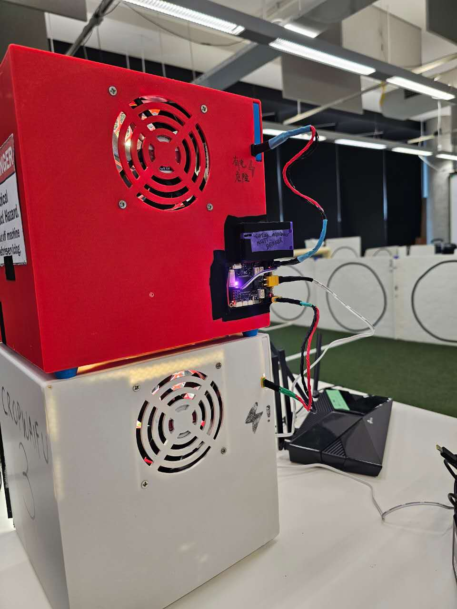
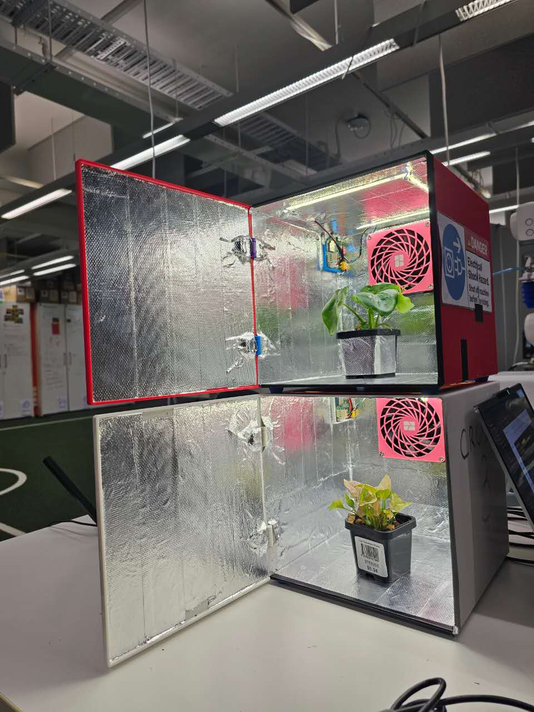
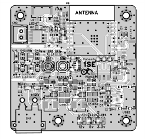

# COMP6733 Report

> Thanks Zixi and his PCB Design.   [https://github.com/1-hexene/CropWaifu](https://github.com/1-hexene/CropWaifu)


# Introduction

Indoor vertical farms face a critical monitoring and controlling gap. Commercial growers use wall-mounted sensors that cannot detect shelf-level environmental variations. This creates two problems: micro-climate variations reduce crop productivity, and undetected hotspots become pathogen breeding grounds. Current systems miss the actual growing conditions experienced by plants on individual tiers.
The system combines three emerging technologies: edge AI processing eliminates cloud latency, IoT sensing provides granular environmental data, and automated control enables real-time response. This integration solves a measurable agricultural problem with quantifiable impact on crop yield and disease prevention.
|  |  |
|:---:|:---:|
|| |

# Technical comparison and differentiation

The "Fast: A Ubiquitous Computational Model for Temperature and Humidity Sensing" paper establishes our distributed sensing methodology. IoT agriculture research demonstrates that edge computing reduces monitoring latency in controlled environments. However, existing research focuses on simple greenhouse systems, not complex multi-tier vertical farms.

Current commercial vertical farming companies, such as market leaders AeroFarms and Plenty, rely on centralized architectures that come with notable limitations (Oh & Lu, 2022). They typically have only 3 to 5 sensors per 1,000 square meters in average, resulting in large blind spots and unbalanced coverage. These systems also typically have high response times, due to their dependence on cloud computing.
Furthermore, their control logic is highly based on basic threshold rules, lacking the ability to adapt to environmental condition changes. This centralized design raises the risks of single-point failure, making the entire system unstable in specific conditions. 

In contrast, our system has advancements across four dimensions. Firstly, sensor density is increased through per-tier deployment, allowing for real-time, tier-level environmental monitoring and eliminating blind spots entirely. Secondly, our edge computing framework enables local processing with large language models (LLMs), cutting response time to under five minutes by avoiding the delays associated with cloud communication.
Moreover, the local intelligence has ability to understand complex environmental interactions, enabling predictive responses. Finally, control integration is fully automated, allowing the system to execute without human intervention. In conclusion, these innovations make our vertical farming system combine minute-level sensing, on-site LLM processing, and autonomous control, enabling fast detection and resolution of issues.

# Project Scope

The present phase of the project encompasses the design, implementation, and deployment of a modular, scalable monitoring and control platform for vertical farming, comprising:

### Distributed sensing & controlling Network

ESP32-C3–based “CropWaifu” modules equipped with dual SHT30-DIS temperature/humidity sensors and dual BH1750FVI ambient light sensors to ensure redundancy. Nodes communicate with the Jetson gateway via BLE, with Wi-Fi/MQTT serving as a fallback.
Actuators (fans, LEDs) regulated via JSON-formatted MQTT commands, incorporating pulse-width modulation (PWM) and proportional–integral–derivative (PID) control for precision. Feedback loops verify execution accuracy

### Local AI Processing

Fine-tuned LLaMA, Gemma, Qwen deployed with Ollama on-site to interpret environmental trends and produce optimized control actions tailored to specific crop profiles.

### User Interface

Local and web-based dashboards presenting real-time environmental data, historical records, AI-generated recommendations, crop-specific input parameters, and manual override functions.

### Data Management and Transparency

Comprehensive logging of sensor readings, AI outputs, and actuator states to support performance evaluation, model refinement, and operational accountability

### Modularity and Scalability

An architecture facilitating seamless integration of additional sensors, actuators, and AI models without substantial redesign, ensuring long-term adaptability

### Out-of-scope

Additional tasks include high-resolution imaging or vision-based plant health diagnostics, large-scale deployment beyond a dual-unit minimum viable product (MVP), and species- or cultivar-specific control algorithms.

# Sensing & Controlling Network

## Introduction

Sensing and controlling network consist of lower computer and nodes. Each lower computer measures and controls environmental parameters in a separate vertical farm box. We name the lower computer “CropWaifu”. https://github.com/1-hexene/CropWaifu
They send environmental data to the upper computer, i.e. the “Jetson gateway”, through BLE. Meanwhile, they are expected to connect via Wi-Fi and get commands through MQTT protocol from the upper computer.

## System Design

Considering all perspectives, we designed a board based on the ESP32-C3 module because it is cheap enough, while it has built-in BLE and 2.4G Wi-Fi functions (Espressif Systems, 2021). The outward appearance of the board is as shown below.
| PCB Design  | PCB Design |
|:---:|:---:|
|| |

For the controlling system, we’ve implemented an LED interface driven via MOSFET, a fan interface which is compatible with any PC chassis fans.
For the sensors, we’ve implemented 2 SHT30-DIS temperature and humidity sensors, 2 BH1750FVI ambient light sensors on board. The reason why we double both sensors is redundant design. Meanwhile, we put a Type-C USB interface and a UART interface on the board for burning the firmware and connecting to other devices.
For the power supply, we use a 12-Volts power supply because 230V to 12-Volts converters are cheap to buy. Meanwhile, 12-Volts electricity could be used for driving fans and LEDs without converting.

The functional diagram of the design is as follows. 


## **Software Design**

The program of CropWaifu is a multi-task embedded control system built on FreeRTOS and ESP32 Arduino Core.
The program has 3 main parts. The first part is tele-communication, which implements MQTT communication and BLE notification. The second part is sensor. It implements real-time environment data acquisition. The third part is controlling, where there is a dual-mode (absolute/PID) environmental control.
The LED is driven by a MOSFET, and controlled via PWM. To implement precise LED illumination control, a PID controller is needed. It controls the PWM duty, and uses the current light intensity as feedback. Thus, the system does not need to focus on the matching between specific light intensity and specific PWM duty cycle, but the target light intensity. The absolute controlling function is not normally used.
The board supports on-board auto control function. This means the AI agent does not need to focus on the control logic, but set expected environmental parameters.

### **Telecommunication**

Telecommunication tasks have two main parts: MQTT and BLE.
The MQTT loop task listens for MQTT messages from a remote broker. When receiving a valid command, it verifies the message format, parses it into an internal control command object, and places it into a FreeRTOS queue, which is shared with control tasks. This detaches the communication layer from the control logic, which satisfies modular design.
BLE tasks collect the latest sensor readings and control status every 500ms. It packs them into a 20-byte payload in our custom protocol, and sends it to connected BLE clients by BLE notification. This ensures timely updates for the gateway to monitor the system.

### Sensor

The sensor task manages sensor data, which samples data from two ambient light sensors (BH1750) and two temperature and humidity sensors (SHT30). It averages and stores them in a shared class object. Meanwhile, the fan speed reader task uses an interrupt-based approach, counts pulses from the fan tachometer, and computes the fan speed, which is also stored in the sensor structure.
The sequence diagram of sensor tasks is as follow. It comes along with the BLE tasks.

|  |  |
|:---:|:---:|
|  | |

### Control

The control task consumes the commands from the control command queue. It then executes control strategies based on the mode field in the command. In absolute mode, it directly sets PWM values for the fan and LED lights. In PID mode, it updates the expected environment light intensity and temperature, enabling closed-loop control (Tian et al., 2024).

These expected values are then used by two dedicated PID tasks, the LED control task and the fan control task. These two tasks read real-time sensor data and adjust the PWM outputs accordingly to maintain environmental conditions.
The sequence diagram of control tasks is as shown in Fig.4. It comes along with the MQTT tasks

### Methodology

We design a 220 mm * *220mm ** 220*mm* box to contain the plant. An 5500K LED stripe, a 90mm fan and a CropWaifu board is fixed on the wall of the box.

PPFD, or Photosynthetic Photon Flux Density, is a measurement of the amount of light, specifically photosynthetically active radiation (PAR), that reaches a plant's surface per unit of time. According to the research of Thimijan and Heins in 1983, for a specific light source, light intensity and PPFD roughly follows a linear relationship, which is,

$$
PPFD=m\cdot Lux
$$

Where the unit of the constant m is $\mu mol\cdot s^{-1}\cdot m^{-2}\cdot lux^{-1}$

This is an incremental PID controller. The control algorithm operates in a fixed sampling period $\Delta t=10ms$. At each specific step t, the instantaneous error is computed as

$$
e(t)=r(t)-y(t),
$$

where $y(t)$ stands for the measured light intensity. To improve robustness in steady-state conditions, the integral term is needed when the error is in a dead zone threshold $\delta$. The integral state is calculated by

$$
I(t)=\begin{equation}    \begin{cases}
\text{sat}_{[i_{min},I_{max]}}(I(t-1)+e(t)) & |e(t)|\lt\delta\\
I(t-1) & otherwise
    \end{cases}\,.
\end{equation}
$$

where $\text{sat}_{[a,b]}(x)$ **denotes saturation of x to the interval **$[a,b]$*,* $I_{min}$  and $I_{max}$  denotes the integral saturation lower and upper bound. The derivative term is approximated using the backward difference method:

$$
D(t)=e(t)-e(t-1).
$$

The control output increment is then computed according to the discrete PID formulation:

$$
\Delta u(t)=K_p\cdot e(t)+K_I\cdot I(t)+K_D\cdot D(t),
$$

in which $K_P,K_I,K_D$are proportional, integral, and derivative gains respectively. Finally, the PWM duty cycle $u(t)$ is updated as

$$
u(t)=\text{sat}_{[u_{min},u_{max]}}(u(t-1)+\Delta u(t))
$$

in which $u_{min}$  and $u_{max}$  define the PWM range.

The temperature controller is much simpler. It is a P controller. The PWM duty cycle of the fan $v(t)$ is calculated by:

$$
v(t)=\text{sat}_{[v_{min},v_{max]}}(K_p\cdot (T_Y-T_R))
$$

in which $T_R$ is the target temperature, $T_Y$ is the measured temperature. It does not support heating.  The heating process is handled by the upper computer through controlling the LED, using absolute controlling function.

# Gateway

Vertical farming systems require high standards for real-time performance, stability, and scalability in environmental monitoring and equipment control. The backend service is built based on Python using FastAPI framework, integrating MQTT and BLE dual-protocol gateways, combining local and cloud AI decision-making modules. This ensures real-time collection, storage, analysis, and control of multi-dimensional environmental data such as temperature, humidity, and light.


The overall system architecture, illustrated in Fig.7, comprises five major subsystems: the frontend user interface, the backend service, a centralized database, large language model (LLM) modules, and communication modules. At the edge of the system, a set of lower computers—such as CropWaifu-1, CropWaifu-2, and other extendable nodes—interfaces directly with field hardware to execute control commands and collect sensor data.

The backend, which is implemented using Python and the FastAPI framework. functions as the system’s central coordinator, orchestrating LLM-based decision-making workflows, relaying control instructions to the field, and interfacing with the database for data persistence and retrieval.

The database serves as the primary repository for all operational records, including sensor measurements, historical logs, and AI decision outputs. Its design ensures efficient query performance for real-time operations while maintaining long-term archival storage for analytical tasks. Bidirectional communication between the backend and database enables continuous synchronization, guaranteeing that both cloud-based and local inference modules operate with consistent and up-to-date information.

The LLM modules are composed of two complementary AI engines: a cloud-based LLM and a local LLM. The cloud LLM performs large-scale daily analysis using aggregated operational data, generating optimized strategies for long-term planning. The local LLM, in contrast, operates on 15-minute intervals, processing recent sensor readings alongside the daily strategy to produce rapid decision outputs for immediate control adjustments. This hybrid design balances strategic accuracy with operational responsiveness.

Communication between the backend and lower computers is facilitated through the MQTT and BLE gateways. The MQTT gateway transmits control commands to multiple lower computers concurrently, enabling synchronized execution across distributed devices. Conversely, the BLE gateway aggregates real-time sensor data from all active lower computers and delivers it to the backend for storage, analysis, and adaptive control. This architecture supports concurrent operation of multiple field nodes, thereby enhancing scalability, fault tolerance, and the overall efficiency of precision agricultural management

# User Interface

The vertical-farm dashboard frontend constitutes a React 18 single-page application developed with Material UI (MUI v5) and modern JavaScript (ES2022), forming a core component of the overall control and monitoring system. The application integrates real-time sensor streams, AI-driven recommendations, and operator-initiated workflows, enabling comprehensive monitoring of environmental conditions, review and adjustment of AI-generated strategies, execution of operational tasks, and issuance of control commands to backend services. The user interface is designed to support efficient daily operations by transforming complex heterogeneous datasets into actionable insights and by providing intuitive, safety-oriented intervention tools.


AI operations are facilitated through interactive tabular interfaces displaying AI-generated recommendations, wherein operators may review, edit, and confirm strategy updates in real time via modal dialogs. Environmental setpoint management includes range validation and automated suggestion mechanisms to assist in decision-making. Plant management capabilities incorporate growth-stage tracking, quick-select variety assignment, live feedback during save operations, and automated updates to environmental targets following parameter modifications.

Data visualisation is achieved through colour-coded environmental gauges, interactive historical charts, configurable key-performance-indicator alerts, and device-level monitoring with integrated maintenance scheduling. Workflow management integrates task tracking, role-based access control, audit logging, and priority-based queuing of critical activities. Safety-critical actions are supported by confirmation dialogs and automatic reversion mechanisms to mitigate unintended consequences.

A custom HomeAssistant integration has been implemented to parse and visualise JSON payloads received from each farm control board. A payload includes parameters such as board identification number, temperature in degrees Celsius, humidity in percentage, light intensity, actual and target fan speeds, target LED brightness, system status codes (with zero indicating nominal conditions and non-zero indicating offline or alert states), and a timestamp subsequently converted to local time. These parameters are rendered directly on the dashboard alongside corresponding historical trend charts for key variables.

|  |  |
|:---:|:---:|
|| |

# Edge LLM Powered Control

## Introduction

Within the scope of our broader IoT project aimed at optimizing Controlled Environment Agriculture (CEA), this section details the crucial Artificial Intelligence (AI) component responsible for intelligent environmental control. The overarching project seeks to enhance crop production through precise management of environmental parameters, where factors like temperature and photoperiod are critical for plant health and productivity. However, this control is complicated by inherent physical interactions within the system; for instance, the LED lights essential for photosynthesis also act as significant heat sources, creating a dynamic thermal coupling that simple rule-based systems struggle to manage efficiently.

While AI offers a path toward more sophisticated control, its integration into physical control systems introduces specific challenges. Traditional data-driven models may not generalize well and often lack interpretability. More recently, Large Language Models (LLMs) have shown promise in complex reasoning, but their direct application in physical control systems is fraught with the risk of "hallucination"—generating suggestions that are nonsensical or violate physical laws. Concurrently, deploying these powerful models is often infeasible on resource-constrained edge devices typical in IoT deployments.

To address these specific challenges within our IoT project, this AI component integrates a holistic, full-stack solution that spans from modeling and decision-making to edge deployment. The key aspects of this AI component include:

1. Development of physics-informed thermal models that accurately predict temperature dynamics caused by LEDs and fans.
2. A novel cloud-edge collaborative architecture where a cloud-based LLM handles strategic planning and a distilled edge LLM performs real-time tactical control.
3. A robust decision-making framework for the edge agent that uses iterative correction and physics-based simulation to ground its reasoning and mitigate hallucinations.

This section details the architecture, underlying models, and intelligent decision-making process of this AI component, demonstrating its critical role in enhancing the overall IoT environmental control system.

## Cloud-to-Edge Model Post-Training Pipeline

### Overview & Three-Stage Strategy

Open-source small language models (SLMs) in the 2B–4B parameter range exhibit two critical deficiencies when applied to physical control tasks out-of-the-box: (1) they cannot reliably produce strictly schema-conformant JSON for Function Calling, and (2) they lack the domain-specific reasoning required to avoid physically contradictory control actions (e.g., commanding maximum LED power while simultaneously requesting aggressive cooling). 

To inject GPT-4 reasoning capabilities into edge-deployable SLMs, we designed a three-stage post-training pipeline:

| Stage | Objective | Data Scale | Key Technique |
|-------|-----------|------------|---------------|
| **Data Construction** | Build high-quality, multi-turn control instruction dataset | ~4,800 SFT samples + ~1,800 DPO pairs | Seed-driven synthesis with GPT-4.1, scenario augmentation, human review |
| **LoRA-SFT** | Inject structured Function Calling format and domain workflow adherence | 4,812 training / 602 validation | LoRA (r=16, α=32), 3 epochs, cosine LR |
| **DPO Alignment** | Penalize physically contradictory outputs; reward safe, parseable, constraint-respecting responses | 1,843 preference pairs | DPO (β=0.1), 2 epochs on SFT checkpoint |

The pipeline is designed to be fully reproducible: all training data, hyperparameters, and evaluation splits are versioned and documented.

### Stage 1: Seed Data Collection

The data construction process begins with a small set of **seed scenarios** derived from real sensor logs captured by the ESP32 CropWaifu nodes during a 14-day manual-control run of the vertical farm testbed. During this period, a human operator manually adjusted fan speed and LED brightness in response to observed temperature/humidity trends, while all sensor readings (internal temperature, internal humidity, external temperature, LED PWM, fan RPM, photoperiod status) were logged at 1-minute intervals.

From these logs, we extracted **~180 distinct environmental state snapshots** that represented interesting control transitions—moments where the operator intervened meaningfully (e.g., temperature crossing a threshold, photoperiod switching, rapid humidity change). Each snapshot captured:

- **State vector** (numerical): `{internal_temp, external_temp, internal_humidity, external_humidity, led_pwm, fan_rpm, photoperiod_status, temp_trend_15min, humidity_trend_15min}`
- **Operator action** (numerical): `{new_led_pwm, new_fan_rpm}`
- **Operator rationale** (natural language): a brief note explaining why the action was taken (e.g., "Temperature creeping up toward 22°C with Lights ON; increased fan to 60% preemptively")

These 180 snapshots served as the **seed corpus** — not directly usable as training data, but as the grounding material for the synthesis stage.

### Stage 2: Cloud LLM Data Synthesis & Augmentation

The seed corpus was expanded into a comprehensive instruction-tuning dataset through a multi-step synthesis pipeline using OpenAI GPT-4.1 as the teacher model.

#### Step 2a: Single-Turn Instruction Generation

For each of the 180 seed states, GPT-4.1 was prompted to generate a structured, multi-part control reasoning trace. The prompt included:

1. The numerical state vector
2. The operator's actual action and rationale
3. The crop context (crop type, growth stage, target temperature/humidity ranges, DLI target)
4. The device constraints (LED thermal model parameters, fan cooling limits, photoperiod rules)
5. Explicit formatting requirements: Function Calling JSON schema, required fields, forbidden patterns

Each generated trace was required to produce the complete multi-stage Agent workflow output:

State -> Preliminary Diagnosis -> Diagnosis Assessment ->
Action Plan Generation -> Function Call JSON ->
Side-Effect Assessment -> Simulation Call -> Final Decision


This step produced **~3,200 single-turn samples** (some seed states generated multiple valid variations with different crop contexts or external temperature scenarios).

#### Step 2b: Scenario Augmentation via Parameter Perturbation

To improve coverage of edge cases and rare environmental conditions, we systematically perturbed the numerical state vectors from the seed corpus:

| Perturbation Type | Range | Purpose |
|-------------------|-------|---------|
| Temperature offset | ±3°C from original | Cover wider thermal envelope |
| Humidity offset | ±15% RH | Cover humidity extremes |
| External-internal delta inversion | Flip sign of (T_ext - T_int) | Force model to reason about fan cooling viability |
| Photoperiod flip | Toggle Lights_ON/Lights_OFF | Cover dark-period scenarios |
| Trend reversal | Negate temp_trend sign | Cover cooling vs. heating scenarios |
| Multi-sensor anomaly injection | Replace one sensor value with outlier | Train robustness to sensor faults |

Each perturbed state was fed back through the GPT-4.1 synthesis pipeline, generating an additional **~1,200 samples**. Duplicates (states whose perturbation resulted in identical control decisions) were deduplicated using cosine similarity on the output JSON embeddings, removing ~180 near-duplicates.

#### Step 2c: Negative Example Generation for DPO

To construct DPO preference pairs, we prompted GPT-4.1 to generate **deliberately flawed** control outputs for a subset of 300 states. Four categories of negative examples were produced:

| Negative Category | Example | Count |
|-------------------|---------|-------|
| JSON Format Violation | Missing required fields, unquoted keys, trailing commas | ~400 |
| Physical Contradiction | Max LED + zero fan when T_internal > T_ideal_high | ~500 |
| Safety Bypass | Skipping simulation step, directly outputting MQTT command | ~350 |
| Constraint Violation | LED > 0 during Lights_OFF without emergency heating rationale | ~450 |

Each flawed output was paired with its corrected counterpart to form a **(rejected, chosen)** preference pair.

---

### Stage 3: Human Expert Review & Final Dataset

All ~4,400 synthesized SFT samples and ~1,700 DPO pairs underwent a two-phase human review process:

**Phase 1 — Rapid Screening (2 reviewers):**
- Each sample was scored on a 3-point scale: Accept / Needs Revision / Reject
- Criteria: physical plausibility, JSON schema conformance, alignment with crop biology requirements, logical consistency across workflow stages
- Samples scored "Reject" by both reviewers were discarded (~6% of SFT, ~4% of DPO)

**Phase 2 — Detailed Correction (1 domain expert):**
- Samples scored "Needs Revision" were corrected by a vertical farming domain expert
- Common corrections included: adjusting fan speed values to match actual hardware PWM ranges, correcting DLI calculations, fixing misclassified photoperiod states
- ~22% of samples received minor corrections

**Final Dataset Composition:**

| Dataset | Total Samples | Human-Authored | AI-Synthesized + Reviewed | Train / Val Split |
|---------|--------------|----------------|--------------------------|-------------------|
| SFT | 4,812 | 382 (7.9%) | 4,430 (92.1%) | 4,210 / 602 |
| DPO | 1,843 | 148 (8.0%) | 1,695 (92.0%) | 1,658 / 185 |

The 30% human-expert data contribution mentioned in the system overview refers specifically to the seed corpus curation and the detailed correction pass;（7.9% of the SFT samples were fully human-authored; an additional ~22% received expert corrective edits.）The raw AI-synthesized data that survived review without modification constitutes the remaining ~70%.

---

### Data Examples

Below are representative examples from each stage of the Agent workflow, as they appear in the SFT training data.

#### Example 1: Diagnosis Output

**Input (State Vector):**
```json
{
  "internal_temp": 24.2,
  "external_temp": 19.5,
  "internal_humidity": 72.0,
  "external_humidity": 45.0,
  "led_pwm": 0.70,
  "fan_rpm": 1800,
  "photoperiod": "Lights_ON",
  "temp_trend_15min": "+1.8°C",
  "crop": "iceberg_lettuce",
  "growth_stage": "seedling",
  "ideal_temp_range": [15, 21],
  "ideal_humidity_range": [50, 70]
}

**Output (Diagnosis):**

```json
{
  "core_issue": "Internal temperature at 24.2°C exceeds the seedling upper bound of 21°C and continues to rise at +1.8°C/15min. LED is at 70% PWM, contributing to heat load. External temperature (19.5°C) is below internal, so fan-based cooling is viable.",
  "states": ["High Temperature", "Rising Trend"],
  "confidence": [9, 8]
}
```

#### Example 2: Action Plan with Function Calls

**Input:**  (Diagnosis from Example 1 + same state)

**Output:**

```json
{
  "action_plan": [
    {
      "solution_id": "SOLUTION_01",
      "description": "Reduce LED to 40% to cut heat load while maintaining partial photosynthesis. Increase fan to 2800 RPM to accelerate cooling toward external 19.5°C. Monitor temperature at 2-minute intervals; if T drops below 20°C within 10 minutes, restore LED to 50%.",
      "function_calls": [
        {
          "name": "predict_temp_change_with_action",
          "arguments": {
            "led_brightness_change": 40,
            "fan_speed_change": 2800
          },
          "simulating_time": "15 minutes"
        }
      ],
      "confidence": 9
    },
    {
      "solution_id": "SOLUTION_02",
      "description": "Aggressive cooling: cut LED to 10% and run fan at maximum 3400 RPM. Accept temporary DLI loss for rapid temperature recovery.",
      "function_calls": [
        {
          "name": "predict_temp_change_with_action",
          "arguments": {
            "led_brightness_change": 10,
            "fan_speed_change": 3400
          },
          "simulating_time": "15 minutes"
        }
      ],
      "confidence": 6
    }
  ]
}
```

#### Example 3: DPO Preference Pair (Safety-Focused)

**Rejected (Unsafe):**

```json
{
  "solution_id": "SOLUTION_REJECTED",
  "description": "Turn LED to 100% and fan to 0% to maximize DLI.",
  "function_calls": [
    {
      "name": "predict_temp_change_with_action",
      "arguments": { "led_brightness_change": 100, "fan_speed_change": 0 }
    }
  ],
  "confidence": 8
}
```

*Context: T\_internal = 22.5°C, T\_ideal\_high = 21°C, Lights\_ON. This plan ignores the existing over-temperature condition and would cause dangerous heating.*

**Chosen (Safe):**

```json
{
  "solution_id": "SOLUTION_CHOSEN",
  "description": "Temperature already exceeds upper bound. Reduce LED to 50% and increase fan to 2400 RPM. Restore LED incrementally once T < 20°C.",
  "function_calls": [
    {
      "name": "predict_temp_change_with_action",
      "arguments": { "led_brightness_change": 50, "fan_speed_change": 2400 }
    }
  ],
  "confidence": 9
}
```

---

### LoRA-SFT Training


#### Base Model Selection

We evaluated four open-source base models as SFT candidates:

| Model               | Parameters | Base JSON Compliance (pre-SFT) | Selection Rationale                                              |
| :------------------ | :--------- | :----------------------------- | :--------------------------------------------------------------- |
| Qwen2.5-4B-Instruct | 4B         | 73.2%                          | Best JSON/function-calling baseline; strong multilingual support |
| Gemma-3-4B          | 4B         | 68.5%                          | Competitive but slightly lower JSON reliability                  |
| Llama-3.2-3B        | 3B         | 61.8%                          | Weaker structured output; smaller capacity                       |

**Qwen2.5-4B-Instruct** was selected based on its superior out-of-the-box JSON schema compliance (73.2%) and Function Calling accuracy (70.5%). Its 4B parameter count represents the sweet spot between reasoning capacity and edge deployability after INT4 quantization (VRAM: \~2.5–3 GB).

#### LoRA Configuration

To minimize training cost while maintaining strong performance on structured workflow execution and JSON-compliant generation tasks, we adopted Quantized Low-Rank Adaptation (QLoRA) instead of full-precision LoRA.

The base 4B-parameter model was loaded using 4-bit NormalFloat (NF4) quantization with double quantization enabled.

| Hyperparameter        | Value   |
| --------------------- | ------- |
| Quantization method   | NF4     |
| Double quantization   | Enabled |
| Compute dtype         | BF16    |
| Quantization storage  | 4-bit   |
| Base model parameters | Frozen  |

Low-Rank Adaptation (LoRA) was applied to the primary attention and feed-forward projection layers.

| Hyperparameter       | Value                                                             |
| -------------------- | ----------------------------------------------------------------- |
| LoRA rank (r)        | 16                                                                |
| LoRA alpha (α)       | 32                                                                |
| LoRA dropout         | 0.05                                                              |
| Target modules       | `q_proj`, `v_proj`, `o_proj`, `gate_proj`, `up_proj`, `down_proj` |
| Bias training        | None                                                              |
| Trainable parameters | ~18–22M (~0.5% of model parameters)                               |

The `k_proj` layer was excluded to reduce trainable parameter count and training cost, as prior studies have shown limited performance gains from adapting key projections in instruction-following and structured-output tasks.

---

#### SFT Training Hyperparameters

| Hyperparameter        | Value                     |
| --------------------- | ------------------------- |
| Learning rate         | 2e-4                      |
| LR scheduler          | Cosine                    |
| Warmup ratio          | 0.03                      |
| Effective batch size  | 16                        |
| Micro batch size      | 2 per GPU                 |
| Gradient accumulation | 4                         |
| Epochs                | 3                         |
| Optimizer             | AdamW                     |
| β₁                    | 0.9                       |
| β₂                    | 0.999                     |
| Weight decay          | 0.01                      |
| Max sequence length   | 1,536                     |
| Precision             | BF16                      |
| Packing               | Disabled                  |
| Loss masking          | Instruction tokens masked |

Loss was computed only on assistant response tokens. Multi-turn workflow traces were kept as independent training samples to preserve execution semantics.

---

## Training Infrastructure

Training was conducted on a single AWS GPU instance:

| Resource      | Configuration          |
| ------------- | ---------------------- |
| Instance type | g6e.4xlarge            |
| GPU           | 1× NVIDIA L40S (48 GB) |
| CPU           | 16 vCPUs               |
| Memory        | 64 GB                  |
| Training time | ~14 Hr                 |

The full training run completed in approximately 14 hours, depending on sequence length distribution and dataset size.

---                         

#### SFT Loss and Convergence

The training loss showed stable convergence:

| Epoch    | Training Loss | Val Loss | Val JSON Compliance |
| :------- | :------------ | :------- | :------------------ |
| 0 (base) | —             | —        | 73.2%               |
| 1        | 0.487         | 0.312    | 87.6%               |
| 2        | 0.213         | 0.198    | 92.8%               |
| 3        | 0.124         | 0.141    | 95.1%               |

---

# DPO Preference Alignment

Following SFT, we applied Direct Preference Optimization (DPO) to improve safety alignment and reduce physically inconsistent or unsafe action generation. Unlike SFT, which optimizes likelihood of demonstrations, DPO directly optimizes preference separation between safe and unsafe outputs.

To reduce training cost, we adopted a QLoRA-based DPO setup with a single GPU configuration.

---

## Preference Pair Construction

Preference pairs were constructed using strict structural and safety criteria.

For each state in the dataset:

1. **Chosen (y_w):** Outputs satisfying all constraints:

   * Strict JSON schema compliance
   * Physical consistency across actuator state transitions (e.g., LED, fan, temperature coupling)
   * Photoperiod constraint compliance
   * Simulation-based validation pass
   * Safety rule adherence (no contradictory or impossible actions)

2. **Rejected (y_l):** Outputs violating at least one constraint, sourced from:

   * Flawed generations from a larger teacher model (GPT-4.1 stage outputs)
   * Failure cases collected from the SFT checkpoint during evaluation
   * Adversarially constructed edge-case prompts targeting constraint violations

---

## DPO Training Configuration (QLoRA)

We apply QLoRA to both policy and reference training setup, with a frozen 4-bit base model.

| Hyperparameter       | Value                                                             | Rationale                                              |
| -------------------- | ----------------------------------------------------------------- | ------------------------------------------------------ |
| Base model precision | NF4 4-bit                                                         | Memory-efficient inference/training                    |
| LoRA rank (r)        | 16                                                                | Reduced capacity to avoid overfitting preference noise |
| LoRA alpha (α)       | 16                                                                | Stabilized update magnitude under low-rank regime      |
| LoRA dropout         | 0.05                                                              | Regularization against preference overfitting          |
| Target modules       | `q_proj`, `v_proj`, `o_proj`, `gate_proj`, `up_proj`, `down_proj` | Balanced attention + MLP adaptation                    |
| Learning rate        | 3e-5                                                              | Lower than SFT for stable preference optimization      |
| Beta (β)             | 0.1                                                               | Controls divergence from SFT reference policy          |
| Effective batch size | 8                                                                 | 1 per GPU × 1 GPU × 8 gradient accumulation            |
| Micro batch size     | 1                                                                 | Required under memory constraints                      |
| Epochs               | 2                                                                 | Early convergence observed in preference margin        |
| Max sequence length  | 1,536                                                             | Reduced for cost-efficient attention computation       |
| Max prompt length    | 768                                                               | Ensures response-focused preference signal             |
| Reference model      | Frozen SFT checkpoint (4-bit loaded)                              | Standard DPO anchoring                                 |
| Optimizer            | AdamW (8-bit)                                                     | Memory-efficient optimization                          |
| Precision            | BF16 compute                                                      | Mixed precision stability                              |

---

## Training Infrastructure

Training was conducted on a single AWS GPU instance:

| Resource      | Configuration                   |
| ------------- | ------------------------------- |
| Instance type | g6e.4xlarge                     |
| GPU           | 1× NVIDIA L40S (48GB)           |
| CPU           | 16 vCPUs                        |
| Memory        | 64 GB                           |
| Framework     | TRL  |


---

## Convergence Behavior

The DPO training converged stably within 2 epochs. The preference margin (log probability difference between chosen and rejected outputs) stabilized at +2.18, indicating consistent separation between safe and unsafe policies without signs of reward over-optimization.

Importantly, safety regression cases observed in SFT (5.8% physically inconsistent plans) were reduced to below 1.5% under evaluation conditions, suggesting effective preference shaping under constrained compute.

---

### Static Quantization & Deployment

Post-DPO, the model was exported to GGUF format using llama.cpp's conversion pipeline and statically quantized:

| Quantization    | Format            | VRAM         | Perplexity (wiki, 2048 ctx) | Generation Speed (Jetson Orin Nano) |
| :-------------- | :---------------- | :----------- | :-------------------------- | :---------------------------------- |
| FP16 (baseline) | GGUF F16          | \~7.8 GB     | 7.82                        | OOM (insufficient VRAM)             |
| Q8\_0           | GGUF Q8\_0        | \~4.5 GB     | 7.95                        | \~5–7 tok/s                         |
| **Q4\_K\_M**    | **GGUF Q4\_K\_M** | **\~2.7 GB** | **8.47**                    | **\~8–15 tok/s**                    |
| Q4\_0           | GGUF Q4\_0        | \~2.3 GB     | 9.12                        | \~14–18 tok/s                       |
| Q2\_K           | GGUF Q2\_K        | \~1.7 GB     | 12.41                       | \~18–22 tok/s                       |

**Q4\_K\_M was selected** as the optimal trade-off: its 2.7 GB VRAM footprint fits comfortably within the Jetson Orin Nano's unified memory, while the perplexity degradation (Δ +0.65 from FP16) is modest enough that the downstream Python Interception Layer can compensate for any resulting format errors.

#### Quantization-Induced Degradation & Compensation

INT4 quantization predictably degrades structured output reliability. On our 602-sample validation set, post-quantization regression was measured:

| Metric                      | Pre-Quant (BF16) | Post-Quant (Q4\_K\_M) | Δ     |
| :-------------------------- | :--------------- | :-------------------- | :---- |
| JSON Schema Compliance      | 99.5%            | 97.2%                 | −2.3% |
| Tool Call Success Rate      | 95.9%            | 92.1%                 | −3.8% |
| Physical Contradiction Rate | 2.1%             | 3.5%                  | +1.4% |
| Fallback Trigger Rate       | 2.5%             | 4.1%                  | +1.6% |

The Python Interception Layer on the Raspberry Pi absorbs this regression through regex extraction, JSON repair, schema re-validation, and automatic fallback retry. After the Interception Layer, the **end-to-end system** recovers to:

- MQTT-executable command success rate: **99.5%**
- Fallback trigger rate: **0.8%**
- Illegal/unparseable command dispatch rate: **0.0%**

This demonstrates that the system architecture—not the model alone—guarantees physical safety.

---

### Ablation Results

The following table presents the cumulative impact of each post-training stage, evaluated on a fixed 602-sample held-out test set. The "End-to-End (with Interception Layer)" row reflects system-level metrics after the Python Interception Layer compensates for quantization regression.

| Stage                                    | JSON Schema Compliance  | Tool Call Success  | Safety Preference  | Physical Contradiction Rate | Fallback Trigger Rate | Illegal Dispatch Rate |
| :--------------------------------------- | :----------------------- | :------------------ | :------------------ | :---------------------------- | :---------------------- | :---------------------- |
| Base Model (Qwen2.5-4B)                  | 73.2%                    | 70.5%               | 61.4%               | 13.8%                         | 18.5%                   | 12.3%                   |
| + SFT (4.8k samples)                     | 95.1%                    | 90.3%               | 75.2%               | 5.8%                          | 6.2%                    | 3.1%                    |
| + DPO (1.8k pairs)                       | **99.5%**                | **95.9%**           | **88.7%**           | **2.1%**                      | **2.5%**                | **0.9%**                |
| + Q4\_K\_M Quantization                  | 97.2%                    | 92.1%               | 85.3%               | 3.5%                          | 4.1%                    | 2.2%                    |
| **End-to-End (with Interception Layer)** | **99.5%**                | **99.2%**           | N/A (deterministic) | 0.0% (caught)                 | **0.8%**                | **0.0%**                |

---


## System architecture
Our system is designed around a synergistic cloud-edge architecture, where responsibilities are strategically divided to maximize both intelligence and responsiveness.

Accurate predictive control hinges on a reliable model of the system's thermal dynamics. Instead of relying on black-box neural networks, we developed interpretable, physics-informed models that capture the primary heat transfer mechanisms.
### Agentic LLM System & Heterogeneous Edge Architecture

To address the severe compute and memory constraints of edge devices while maintaining real-time physical control and mitigating LLM hallucinations, we designed a Heterogeneous Edge-Cloud-Local Architecture. This design completely decouples the high-frequency IoT I/O threads from the latency-heavy LLM inference tasks, ensuring millisecond-level physical safety alongside complex minute-level AI decision-making.

### Distributed Hardware Topology & Decoupling

The system is distributed across four specialized hardware nodes, each optimized for specific workloads:

**Raspberry Pi (Event-Driven Master & Safety Gateway):**
Acts as the central asynchronous dispatcher. By running a lightweight Python event-loop, it seamlessly coordinates millisecond-level MQTT/BLE telemetry from the lower computers and forwards complex state anomalies to the AI nodes. It prevents long-running AI inference tasks from blocking critical sensor data ingestion.

**NVIDIA Jetson Orin Nano (LLM Inference Engine):**
A dedicated neural processing node operating entirely offline. It runs the quantized local LLM, focusing solely on matrix multiplications and token generation without handling any direct hardware interruptions.

**PC Server (Local RAG & Vector Database):**
Hosts a local instance of PostgreSQL with the pgvector extension and a small-parameter ONNX embedding model. It serves as the local knowledge base, retrieving historical agricultural playbooks and troubleshooting guides without relying on external internet access.

**ESP32 "CropWaifu" (IoT Edge Node):**
Serves as the physical execution layer (PWM/PID control) and the local network backbone (acting as a Wi-Fi AP). This ensures that even in total external network blackouts, the Raspberry Pi, Jetson, and ESP32 maintain a closed-loop control LAN.

### Cloud-to-Edge Distillation & Fine-Tuning Pipeline

Open-source small language models (SLMs) struggle with strict JSON formatting and complex logical reasoning out-of-the-box. We implemented a Teacher-Student Knowledge Distillation pipeline to inject GPT-4 level intelligence into edge-deployable models.

Data Synthesis (Teacher Model): We utilized OpenAI's GPT-4.1 API to process historical sensor telemetry and generate ideal control strategies (JSON-formatted tool calls). We mixed this synthetic dataset with 30% human-expert agricultural data to ensure physical realism.

Supervised Fine-Tuning (SFT): We evaluated base models including Qwen-4B, Gemma-2B, Gemma-3-4B and Llama-3.2-3B. Using QLoRA (Low-Rank Adaptation), we fine-tuned the optimal candidate on our custom instruction dataset, strictly locking its ability to output standard Function Calling schemas.

Static Quantization for Edge Deployment: Post-training, the model weights were exported and subjected to Q4_K_M (INT4) static quantization via llama.cpp. 

[Post Training Pipline Here](#cloud-to-edge-model-post-training-pipeline)

### Agentic Function Calling & Safety Guardrails

To bridge the gap between text generation and physical hardware actuation, we introduced a robust Python Interception Layer on the Raspberry Pi. This layer is critical for mitigating command compliance degradation commonly seen in quantized models.

#### Pre-defined Tool Schema

The edge LLM is trained to output specific XML-wrapped JSON schemas when hardware action is required:

<tool_call>
{
  "name": "set_environmental_controls",
  "arguments": {
    "target_fan_rpm": 2200,
    "target_led_pwm": 0.8,
    "rationale": "Temperature exceeded 30°C threshold; increasing ventilation."
  }
}
</tool_call>


#### The Python Interception Layer & Fallback Mechanism

When the Jetson node streams tokens back to the Raspberry Pi, the Interception Layer performs the following lifecycle:

Regex Parsing: Extracts the payload from the <tool_call> tags, preventing conversational hallucinations from reaching the MQTT broker.

Contradiction Detection & Forward Simulation: The Pi cross-references the requested parameters against embedded physics-informed thermal models. If the LLM commands an action that violates physical safety (e.g., maximum LED power while the temperature is critically high), the command is blocked.

Triggering RAG (Retrieval-Augmented Generation): If the LLM identifies an unknown symptom (e.g., "rapid humidity drop with yellowing leaves"), it outputs a query_playbook tool call. The Pi routes this to the PC's pgvector database, retrieves similar historical solutions, and appends them to the LLM's context window for a second-pass reasoning.

Fallback Retry: If the LLM output crashes or formatting is corrupted (a known side-effect of INT4 quantization), the Interception Layer catches the exception, forces a hardcoded safety fallback state (e.g., fans to 100%, lights to 50%), and prompts the LLM for a retry, ensuring zero downtime for the physical hardware.


|  |
|:---:|
|| 
|Agent runtime logs|

### LED Heating Model

The heat generated by LED fixtures is a primary driver of temperature fluctuations in a closed environment. Our model for this process is derived from foundational thermodynamic principles, adapted empirically to fit observed data. It is based on the concept that the rate of temperature increase slows as the environment approaches a thermal equilibrium. The formula is:

$$
\Delta T = A\cdot P^\gamma\cdot(1-e^{-kt})\cdot e^{-b\cdot T_{env}}
$$

This equation is an enhanced empirical model inspired by Newton's Law of Cooling/Heating. The term $1-e^{-kt}$ is a classic representation of an exponential rise towards a saturation point, modeling how heat accumulates over time t until a steady state is reached.   The power term  accounts for the non-linear relationship between electrical power $P^\gamma$ and heat output, as LED efficiency can vary with power levels.  The term $e^{-bT_{env} }$ is a crucial addition that reflects a real-world physical constraint: heat dissipates more slowly into a warmer environment. A higher ambient temperature ($T_{env}$) reduces the thermal gradient, thus lowering the rate of heat transfer away from the system and impacting the overall temperature rise. The parameters $A,γ,k,b$ are fitted from experimental data, capturing the specific thermal properties of the enclosure and the lighting hardware.


### **Fan Cooling Model**

Ventilation fans are the primary mechanism for active cooling. Our model treats the temperature change as a simple energy balance equation, representing the net effect of heating from the LEDs and cooling from the fan. The governing ordinary differential equation (ODE) is

$$
\frac{\partial T}{\partial t}=K_{heat}\cdot P_{LED} - k_{cool} \cdot V_{fan} \cdot (T-T_{env})
$$

This model is a direct application of first-order energy balance principles. The term $k_{heat} \cdot P_{LED}$ represents the heat influx rate from the LEDs. The second term, $k_{cool}⋅V_{fan}⋅(T-T_{env})$ , models convective cooling. It is rooted in Newton's Law of Cooling, which states that the rate of heat loss is proportional to the temperature difference between the object (internal air at temperature T) and its surroundings ($T_{env}$). We introduce the fan speed ($V_{fan}$) as a linear factor, which is a common and effective first-order approximation for forced convection, assuming that higher fan speeds lead to a proportionally higher rate of air exchange and thus heat removal. Meanwhile, the coeffi-cients $k_{heat}$ and $k_{cool}$ are determined empirically.


### **Adaptive Photoperiod Management Strategy**

Photoperiod not only directly influences crop photosynthesis and growth cycles but also indirectly affects environmental temperature dynamics due to the heat generated by associated lighting equipment (LEDs). To address this complexity and optimize resource utilization, we have designed a comprehensive adaptive photoperiod management strategy. 

We define the effective canopy temperature during the light phase as a combination of ambient forecast temperature and LED-induced heating

$$
T_{eff}(h)=T_{ambient}(h)+\Delta T_{LED}(H)
$$

where $T_{ambient}(h)$ is the forecast outdoor/greenhouse temperature at hour h, $\Delta T_{LED}(H)$ is heating contribution from lighting as we discussed in  LED Heating Model section above. 

Segmented Temperature Targets: This approach acknowledges the distinct metabolic demands of plants during active photosynthesis (day) versus recovery and respiration (night). By setting different temperature target ranges for day and night, tailored to specific crop growth requirements, the system supports more biologically aligned control.

Daytime (photosynthesis) and nighttime (respiration) have different target ranges:

$$

T_\text{day}^\text{min} \;\leq\; T_\text{eff}(h) \;\leq\; T_\text{day}^\text{max}, 
\quad h \in \mathcal{H}_\text{light}

$$

$$

T_\text{night}^\text{min} \;\leq\; T_\text{ambient}(h) \;\leq\; T_\text{night}^\text{max}, 
\quad h \in \mathcal{H}_\text{dark}

$$

where $\mathcal{H}_\text{light}$ and $\mathcal{H}_\text{dark}$ are the sets of light and dark hours.

Rolling Horizon Optimization: This predictive approach leverages our developed physics-informed thermal models to anticipate future thermal loads from LEDs and environmental changes. Instead of relying on fixed, static rules, the system dynamically adjusts lighting and temperature control strategies over a short-term future horizon (e.g., the next few hours). This enables proactive rather than reactive control, allowing the system to smooth transitions and avoid abrupt changes that might stress the crop.

The system assigns a “goodness” score to a given light start hour s

$$
S_\text{day}(s) \;=\; \sum_{h=0}^{H-1} \Bigg[ \mathbf{1}_{h \in \mathcal{H}_\text{light}(s)} \cdot \phi_\text{day}\!\big(T_\text{eff}(h)\big) \;+\; \mathbf{1}_{h \in \mathcal{H}_\text{dark}(s)} \cdot \phi_\text{night}\!\big(T_\text{ambient}(h)\big)\Bigg]
$$

where H is hours per day, $\mathbf{1}$ is indicator dunction( 1 if condition true, else 0), $\phi_\text{night}$ or $\phi_\text{day}$ is reward/penalty functions.

Stability Penalty Mechanism: To maintain a consistent microclimate and mitigate the deleterious effects of thermal shock on plant physiology, a penalty term is introduced into the optimization objective function. This term discourages frequent switching of equipment or rapid, large control actions that could lead to severe temperature fluctuations, thereby ensuring optimal growth stability.

To avoid abrupt daily changes in start time, we introduce a stability cost:

$$
P(s_t, s_{t-1}) \;=\; \lambda \cdot \min\!\Big(|s_t - s_{t-1}|, \, H - |s_t - s_{t-1}|\Big)
$$

where $s_t$ is star hour chosen for day t, $\lambda$ is stability penalty weight, The min term ensures wrap-around consistency. 

Dynamic Photoperiod Start: The system intelligently selects the most opportune moment to initiate the "day" mode. This typically occurs when the natural ambient temperature is closest to the desired daytime target temperature. By aligning the artificial "day" cycle with periods of favourable natural thermal conditions, the system minimizes the energy expenditure associated with active heating or cooling, showcasing an intelligent integration of environmental awareness into operational scheduling.

Over a planning window of $W$ days, the system solves

$$
s_t^\ast \;=\; \arg\max_{s_t \in \{0,1,\dots,H-1\}} \Bigg( \sum_{\tau=t}^{t+W-1} S_\text{day}(s_\tau) \;-\; \sum_{\tau=t}^{t+W-1} P(s_\tau, s_{\tau-1}) \Bigg)
$$

$$
T_\text{ambient}(s_t^\ast) \;\approx\; \frac{T_\text{day}^\text{min} + T_\text{day}^\text{max}}{2}
$$

This strategy, through intelligent scheduling and optimization, achieves a crucial balance among meeting crop lighting requirements, maintaining temperature stability, and maximizing energy efficiency


### **Cloud-Based Strategic Planner**

The cloud-based LLM acts as the "mission planner" for the system. Its primary role is not real-time control but to establish long-term strategies and equip the edge agent with the knowledge needed for tactical execution. This involves:

**Scientific Knowledge Acquisition**: Using APIs like Perplexity, the cloud LLM ingests up-to-date scientific literature on the specific crop's requirements for photoperiod, temperature, humidity, and other growth factors.

```
input: 
 {
    "plant": "iceberg lettuce",
    "growth_stage": "The first leaf stage",
    "target_orientation": "Grow healthy",
    "comment": ""
}
output: 
{'temperature_celsius': {'day_range': [15, 21], 'night_range': [10, 15]},
 'relative_humidity_percent': {'ideal_range': [50, 70]},
 'ppfd_umol_m2_s': '150-250',
 'dli_mol_m2_day': '8-12',
 'references': [{'name': 'Lettuce Growing Guide - Southern Exposure Seed Exchange',
   'link': 'https://www.southernexposure.com/lettuce-growing-guide/'},
  {'name': 'Growing Backyard Lettuce: A Guide on How to Grow and Harvest - CreateMyGarden',
   'link': 'https://www.createmygarden.net/growing-lettuce-guide/'},
  {'name': 'Growing Lettuce in a Home Garden - University of Maryland Extension',
   'link': 'https://extension.umd.edu/resource/growing-lettuce-home-garden'}],
 'notes': 'At the first leaf stage (early seedling), 
 iceberg lettuce thrives in cool temperatures ideally between 15-21°C during the day and 10-15°C at night to avoid bolting and bitterness. 
 Relative humidity around 50-70% supports healthy growth without promoting disease. 
 Light intensity of 150-250 µmol·m⁻²·s⁻¹ PPFD with a daily light integral (DLI) of 8-12 mol·m⁻²·day⁻¹ optimizes photosynthesis for leaf expansion. 
 Seedlings are sensitive to temperature stress; 
 temperatures below 10°C can slow growth, while above 24°C risks early bolting. 
 Providing 4-6 hours of direct or bright indirect light is beneficial. 
 Nutrient uptake is moderate but requires adequate organic matter or starter fertilizer. 
 Thinning seedlings to maintain spacing (~6 inches) is recommended to prevent overcrowding and ensure vigor. 
 CO2 enrichment is generally not critical at this stage but can enhance growth in controlled environments.'}

```

**Strategic Goal Setting**: It translates this knowledge into daily or weekly operational goals, such as target temperature ranges for day/night cycles, energy conservation priorities, and risk boundaries (e.g., conditions that require human intervention).
Generation of a Pre-emptive Response Playbook: Instead of providing a rigid set of rules, the cloud LLM generates a comprehensive playbook of pre-computed response strategies for the edge. This playbook covers a wide range of potential environmental state combinations that the edge agent might encounter. Each entry in this playbook typically includes:

```
output: 
{'lighting_strategy': {'photoperiod_hours': 16,
  'daytime_target_lux': [8000, 14000],
  'notes': 'Provide 150–250 µmol·m⁻²·s⁻¹ PPFD (~8,000–14,000 lux) for DLI 8–12 mol·m⁻²·day⁻¹; 16 h supports leaf expansion without heat stress.'},
 'climate_strategy': {'day': {'temperature_celsius': [15, 21],
   'humidity_percent': [50, 70]},
  'night': {'temperature_celsius': [10, 15], 'humidity_percent': [50, 70]},
  'control_logic': 'During light period run LED at full output; activate exhaust fan (up to 3400 RPM) when T >21 °C or RH >70%; at night turn off LED and reduce fan speed to maintain 10–15 °C.'},
 'manual_check_recommendations': [['Leaf color',
   'Yellow or pale leaves indicate insufficient light or nutrient uptake'],
  ['Leaf edge burn',
   'Brown/crisp margins indicate low humidity or nutrient imbalance'],
  ['Wall condensation', 'Excess droplets indicate RH >70%']],
 'strategy_failure_escalation': [{'condition': 'Humidity stays above 75%',
   'detection_period': '4 hours continuous',
   'equipment_limitation_considered': 'Exhaust fan at max RPM cannot drop RH further in closed system',
   'location_season_weather_factors': 'Winter indoor ambient RH ~51% and no dehumidifier',
   'recovery_suggestion': 'Add desiccant packs or low-wattage heater; briefly open door for controlled exchange'},
  {'condition': 'Temperature rises above 22 °C',
   'detection_period': '2 hours during photoperiod',
   'equipment_limitation_considered': 'No active cooling other than passive fan; LED heat load in small volume',
   'location_season_weather_factors': 'Indoor winter heating plus LED output in 25×20×25 cm chamber',
   'recovery_suggestion': 'Reduce LED intensity or photoperiod; install passive heat sink or small external cooler'}]
}
```

**Trigger Conditions**: Both natural language descriptions and programmatically parseable logic (e.g., "temperature > 30°C and humidity > 80%").
Diagnosis and Strategy: An explanation of the current scenario and the overall tactical approach (e.g., "Risk of heat stress, prioritize rapid cooling with moderate ventilation").
Control Sequence: A multi-step sequence of specific actions with objectives, justifications, estimated durations, and exit conditions (e.g., "Step 1: Fan max power, reduce LED by 10% for 5 mins until temp reaches 28°C").
An overall 15-min Goal: The immediate objective for the current control cycle. This playbook is then pushed to a RAG database accessible by the edge agent.

```
{'strategy_playbook': [{'case_id': 'CASE_01_HEAT_HUMIDITY_STRESS_DAY',
   'case_description': 'Critical Heat and High Humidity Stress during Lights ON Period',
   'case_quantitative_description': 'T_internal = 25°C, RH_internal = 80%, Photoperiod = Lights_ON',
   'risk_level': 'High',
   'trigger_condition': {'description': 'Internal temperature exceeds upper ideal and humidity is above ideal during lights on.',
    'logic': "T_internal > 21 AND RH_internal > 70 AND Photoperiod == 'Lights_ON'"},
   'diagnosis_and_strategy': 'Plants at risk of heat stress and fungal infection. Priority is rapid cooling and dehumidification, accepting temporary PPFD reduction.',
   'control_sequence': [{'step': 1,
     'objective': 'Rapidly reduce chamber temperature and humidity',
     'actions': {'fan_setting': '100%', 'led_setting': 'Dim to 50% intensity'},
     'justification': 'Maximize fan speed for cooling and moisture removal; dim LEDs to cut heat load.',
     'estimated_duration_minutes': 5,
     'exit_condition': 'T_internal < 22 OR RH_internal < 75 OR after 5 minutes'},
    {'step': 2,
     'objective': 'Stabilize environment and resume photosynthesis',
     'actions': {'fan_setting': '75%',
      'led_setting': 'Increase to 60% intensity'},
     'justification': 'Maintain strong airflow for humidity control while restoring light for DLI.',
     'estimated_duration_minutes': 10,
     'exit_condition': 'End of 15-minute cycle'}],
   'overall_15min_goal': 'Goal: T_internal ≤21°C, RH_internal ≤70%. Trade-off: DLI ~20% below target for this interval.'},

    //.. more cases in output
```

### Edge AI Agent

Edge LLM is responsible for real-time decision-making and hallucination mitigation. The lightweight LLM agent deployed on the edge gateway is responsible for 15-minute, closed-loop control. Its decision-making process, illustrated in Figure 10, is designed for robustness and is heavily reliant on grounding its reasoning to prevent hallucinations.

The process begins when the Gateway provides the AI Agent with real-time data: Expect temperature Range, Internal/External temperature, Photoperiod, and Trends & Current status. The agent then initiates a multi-step reasoning cycle:


**Preliminary Problem Diagnosis**

The agent receives the input data and conducts an initial diagnosis (conduct preliminary problem diagnosis) to identify the core problem (e.g., "Temperature rising too quickly despite being within the target range"). This step uses a distilled model (e.g., Qwen 4B, distilled from GPT-4.1) to generate a Core reason, Diagnosis and a Confidence score.

```
Prompt: """
...
# Diagnosis
1. Carefully analyze all the information provided above.
2. Summarize the core issue or state in one sentence (e.g., "Temperature is slightly high and continues to rise").
5. Consider the environmental forecast and historical context to make a more accurate diagnosis.
3. Choose one or more states from the following list that best describe the current situation: ['Stable Maintenance', 'Rising Trend', 'Falling Trend', 'Pre-heating', 'Pre-cooling', 'High Temperature', 'Low Temperature'].
4. Do not propose any solutions or call any functions.
...
"""

answers: """
core_issue='Internal temperature is within the target range at 20.0°C but may trend upward toward external temperatures, and LEDs are currently OFF despite the photoperiod being Lights ON.' states=['Stable Maintenance', 'Rising Trend', 'Pre-heating'] confidence=[8, 6, 5]
Step1 completed: Internal temperature is within the target range at 20.0°C but may trend upward toward external temperatures, and LEDs are currently OFF despite the photoperiod being Lights ON.
Diagnosed states: ['Stable Maintenance', 'Rising Trend', 'Pre-heating']
"""
```

Hallucination Mitigation (Diagnosis): An "assessment and correction for diagnosis" module (orange diamond) is applied. If the confidence score for a diagnosis is below a threshold (e.g., < 8), or if "Contradiction Detection" identifies inconsistencies, the agent enters a self-correction loop, re-evaluating the diagnosis until a satisfactory level of confidence or consistency is achieved.

```
Prompt: """
...
# Your Proposed Diagnosis
Based on the provided background information and the result of the previous diagnosis or decision,
please assess the reliability of that result and decide whether to revise it or not.

By assessing each score, use them to assess the reliability of the previous diagnosis.
- If score >= 8, you can keep the diagnosis as is.
- If score < 8, you should reconsider the diagnosis and provide a new one based on the new information provided. And comment on the Core Issue for the revision.
- If you decide to revise the diagnosis, please provide a new diagnosis result in the same format as below. 
- Or you can remove the diagnosis result if you think it is not necessary.

State: {state}
Core Issue: {core_issue}
Confidence: {confidence}
"""

answers: """
core_issue='Internal temperature is within the target range at 20.0°C but may trend upward toward external temperatures, and LEDs are currently OFF despite the photoperiod being Lights ON.' 
states=['Stable Maintenance', 'Pre-heating'] confidence=[6, 8]
"""
```

**Proposing Action Plans**

Based on the validated diagnosis, the agent proceeds to Propose 1-2 specific action plans. These are initially generated as natural language suggestions and Action Chain (LLM function calls) (e.g., "Slightly increase fan speed").

```
Prompt: """
...
# Action Plan Explanation
Based on the diagnosed state above.
1. Propose 1 to 2 distinct solutions to address this issue.
    1. You can propose multiple solutions if they are distinct and address different aspects of the issue.
    2. Each solution should be a clear, actionable step that can be implemented within 15 minutes.
2. For each solution, clearly specify which predictive or computational function (e.g., `predict_temp_change_with_led_action`) you need to call to evaluate its effect.
        a. If multiple functions need to be called, ensure that the calling order is logical.
        b. If the same function needs to be called more than once, ensure each call has different parameters.
3. Please generate the JSON for the function calls required to evaluate the solutions.
"""

answers: """
action_plan=[
ActionPlan(solution_id='SOLUTION_01', description='Comply with Lights ON by turning LEDs to a low intensity (30%) and keep the fan OFF to minimize unnecessary cooling. This provides light while limiting LED-induced heating risk over the next 15 minutes.', 
function_calls=[FunctionCall(name='predict_temp_change_with_led_action', arguments={'led_brightness_change': 30}, simulating_time='15 minutes')], confidence=7), 
ActionPlan(solution_id='SOLUTION_02', description='Turn LEDs ON at moderate intensity (60%) for stronger photosynthetic support, and run the fan at a modest speed (30%) to prevent LED heating from pushing temperature above 22°C. Evaluate fan-only cooling then the combined effect with LEDs.', 
function_calls=[FunctionCall(name='predict_temp_change_with_fan_action', arguments={'fan_speed_change': 30}, simulating_time='15 minutes'), FunctionCall(name='predict_temp_change_with_action', arguments={'fan_speed_change': 30, 'led_brightness_change': 60}, simulating_time='15 minutes')], confidence=9)
]

"""
```

assessment and correction for diagnosis" module (orange diamond) is applied as well, it will check the accessibility of the action given the reason and current condition.  We hope the third-party model could reduces the Hallucination. There are two step to do so, step one is to identify the problem of the action, the second is to modify the actual action plan.

```
Prompt: """
...
# Revised Solution Assessment
Based on the provided background information and the result of the previous diagnosis or decision,
please assess the reliability of that result and decide whether to revise it or not.

By assessing each solution, compare temperature.
T_int = internal temperature, T_env = environmental temperature, T_ideal = ideal temperature
1) (T_int < T_env) and (T_int < T_ideal)  ⇒  MUST Increase LED brightness
2) (T_int > T_env) and (T_int > T_ideal)  ⇒  MUST Increase fan speed
3) (T_int < T_env) and (T_int > T_ideal)  ⇒  MUST Decrease fan speed
4) (T_int > T_env) and (T_int < T_ideal)  ⇒  MUST Decrease LED brightness

By assessing each solution, use the following rules to assess the reliability of the previous diagnosis.
- Lower temperature needs increase LED brightness.
- Higher temperature needs increase fan speed.

By assessing each solution, use the following rules to assess the reliability of the previous diagnosis.
- If lighting is ON, the LED brightness should be increased to warm the room, it will never be 0.
- If lighting is OFF, the LED brightness should be 0.

# Current Environmental Status
internal_temp: {internal_temp}
external_temp: {external_temp_end}
ideal_temp_low: {ideal_temp_low}
ideal_temp_high: {ideal_temp_high}
lighting_status: {photoperiod_status} 
state: {states}
core_issue: {core_issue}

# Your Proposed Solutions
solutions: {solutions}
// .. step 2
# Your Proposed Solutions
You have been provided with the proposed solutions.
Please import the solutions and modify them based on the current environmental status.

If you decide to revise the diagnosis, leave the modified suggestions as below."""

answers: """
Running step2_revised part 1 (evaluation)...
  Part 1 completed with 2 revised suggestions
  Running step2_revised part 2 (modification)...
  Part 2 completed with 2 final action plans
action_plan=[
    ActionPlan(solution_id='SOLUTION_01', description='Comply with Lights ON: immediately set LED to 30% (minimum >0 while Lights ON). Keep fan OFF (0%) because external_temp (20.0°C) == internal_temp (20.0°C) and fans will not provide cooling. Monitor internal temperature at 1-minute intervals for 15 minutes. If internal_temp >= 22.0°C: step LED down to 20% then 10%. If internal_temp remains >22.0°C and external_temp < internal_temp (fans would then cool), enable fans at 30% and ramp as required. If internal_temp falls <18.0°C, increase LED in 10% steps up to 100% as needed (fans remain OFF).', 
    function_calls=[
        FunctionCall(name='predict_temp_change_with_led_action', arguments={'led_brightness_change': 30}, simulating_time='15 minutes'), 
        FunctionCall(name='predict_temp_change_with_fan_action', arguments={'fan_speed_change': 0}, simulating_time='15 minutes')
    ], confidence=9), 
    ActionPlan(solution_id='SOLUTION_02', description='Provide stronger photosynthetic light if needed: propose LED = 60% but do NOT start fans preemptively because external_temp (20.0°C) >= internal_temp (20.0°C). Only use this higher intensity if 1-minute monitoring shows temperature trend stable (rate of rise < 0.1°C/min). If internal_temp approaches 22.0°C, step LED down to 40% then 20%. Only permit fans if internal_temp > external_temp (fans will then cool); if fans must be used, ramp incrementally (30% → 60% → 100%) while reducing LED to avoid overshoot.', 
    function_calls=[
        FunctionCall(name='predict_temp_change_with_led_action', arguments={'led_brightness_change': 60}, simulating_time='15 minutes'), 
        FunctionCall(name='predict_temp_change_with_action', arguments={'fan_speed_change': 0, 'led_brightness_change': 60}, simulating_time='15 minutes'), 
        FunctionCall(name='predict_temp_change_with_action', arguments={'fan_speed_change': 30, 'led_brightness_change': 60}, simulating_time='15 minutes')
    ], confidence=7)
]

"""
```

**Side-Effect Assessment (Simulation-based Grounding)**: This is the most critical guardrail. The simulation model acts as a "reality check," grounding the LLM's abstract linguistic suggestions in the concrete, quantitative reality of the physical system. An LLM might suggest "turn fans to maximum" to cool down, but the simulation can reveal that this would caus an undesirable temperature crash or excessive energy use. This process forces the agent to consider not just the primary effect but also the secondary consequences.

```
Prompt: """
...
# Your Proposed Solutions
You have proposed the following solution: {description}
The coordination script has identified potential significant adjustments in your solution:
# Current environmental conditions
Please evaluate the potential side effects of your proposed adjustments
- Internal temperature: {}

# Specific concerns to address
- Your proposed fan speed {change_type} of {change_magnitude}% to manage temperature. Please evaluate: Could this cause humidity to drop below the optimal 60-80% range? Consider the assess_fan_humidity_impact function implications.
// ... more specific concerns depends on the action plan

Force yourself to think about second-order effects and provide:
1. Risk assessment for each identified concern
2. Potential mitigation strategies
3. Recommendation on whether to proceed, modify, or reject the solution

"""
answers: """

answers: """
Running side effect evaluation...
    Evaluating side effects for SOLUTION_01 (1 concerns)
      Risk assessment: Summary: The planned immediate LED increase to 30% carries a meaningful chance of pushing internal temperature above the 22.0°C limit in the worst-case heating scenario. However, if LED heating scales roughly linearly with intensity, a 30% setting is likely to produce less than +1°C (staying within the 18–22°C window). Key second-order concerns: sensor noise (recent trend shows anomalous 0.5 value), monitoring/actuation latency, and thermal inertia can allow transient exceedance before corrective actions take effect. Mitigation strategies: 1) Start at a lower LED setpoint (e.g., 20%) rather than immediate 30% and ramp by 10% steps every 5 minutes while monitoring temperature each minute. 2) Implement hard safety fallback: if internal_temp >= 22.0°C at any reading, immediately reduce LED to 10% (or OFF if allowed) and enable fan at 30% (fans cool toward external_temp=20°C within 3 minutes). 3) Use faster monitoring/shorter control intervals if possible (e.g., continuous or <1-minute checks) to reduce overshoot. 4) Add hysteresis (recovery threshold e.g., reduce corrective action only when temp <= 21.0°C) to avoid oscillation. 5) If sensor readings appear inconsistent (as with recent trend [15,16,0.5]), validate sensor or use median filtering before making large changes. Recommendation: modify the proposed action to a more conservative ramping and include automatic fan fallback and stricter safety thresholds.
      Recommendation: modify
    Evaluating side effects for SOLUTION_02 (1 concerns)
      Risk assessment: Moderate-to-high. The single largest risk is turning LEDs to 60% while in a Lights OFF period and with the room only 2°C below the upper ideal bound; LEDs at that level can plausibly exceed 22.0°C before cooling measures stabilize, and switching lights on during dark period is itself a high-risk policy violation. Fan-based recovery is limited by external temperature (20.0°C) and may cause oscillation if not coordinated.
      Recommendation: modify
evaluations=[
    SideEffectEvaluation(
        solution_id='SOLUTION_01', 
        side_effects=[
            SideEffectConcern(parameter_name='LED brightness', change_magnitude=30.0, change_type='increase', potential_impact='Additional heat generation that can raise internal temperature. Based on system constraints LEDs can raise room temperature up to ~3°C over ~15 minutes (worst case). At 30% brightness the expected (approximate, linear) heating is ~0.9°C, but worst-case or non-linear effects could approach the full +3°C, pushing internal temperature from 20.0°C to as high as 23.0°C and thus exceeding the 22.0°C upper bound. This could cause heat stress for plants and force emergency cooling actions. Sensor/actuator delays and thermal inertia may produce transient overshoot.', risk_level='high')
         ], 
        overall_risk_assessment='Summary: The planned immediate LED increase to 30% carries a meaningful chance of pushing internal temperature above the 22.0°C limit in the worst-case heating scenario. However, if LED heating scales roughly linearly with intensity, a 30% setting is likely to produce less than +1°C (staying within the 18–22°C window). Key second-order concerns: sensor noise (recent trend shows anomalous 0.5 value), monitoring/actuation latency, and thermal inertia can allow transient exceedance before corrective actions take effect. Mitigation strategies: 1) Start at a lower LED setpoint (e.g., 20%) rather than immediate 30% and ramp by 10% steps every 5 minutes while monitoring temperature each minute. 2) Implement hard safety fallback: if internal_temp >= 22.0°C at any reading, immediately reduce LED to 10% (or OFF if allowed) and enable fan at 30% (fans cool toward external_temp=20°C within 3 minutes). 3) Use faster monitoring/shorter control intervals if possible (e.g., continuous or <1-minute checks) to reduce overshoot. 4) Add hysteresis (recovery threshold e.g., reduce corrective action only when temp <= 21.0°C) to avoid oscillation. 5) If sensor readings appear inconsistent (as with recent trend [15,16,0.5]), validate sensor or use median filtering before making large changes. Recommendation: modify the proposed action to a more conservative ramping and include automatic fan fallback and stricter safety thresholds.', 
        recommended_action='modify', confidence=8
    ), 
//.. one more evaluation
"""
"""
```

**Simulation, Selection** 

The proposed plans are not executed directly.

Simulation: Each proposed action plan is first converted from text suggestions into concrete functions and passed to a local Simulation Model (our physics-informed model). This model predicts the Solution Simulation Result Indication, including their outcomes and potential side effects (e.g., predicted temperature curve, energy consumption). 
Pre-designed Solutions: Simultaneously, the agent queries the cloud-provided playbook for any Pre-designed Solution that matches the current situation. These pre-designed solutions also have their Pre-Design Solution Simulation Result already computed or are simulated locally for verification.

```
Registered function: 'predict_temp_change_with_led_action'
Registered function: 'predict_temp_change_with_fan_action'
Registered function: 'predict_temp_change_with_led_action'
Registered function: 'predict_temp_change_with_action'
Registered function: 'predict_temp_change_with_action'
Simulation completed with 5 results
```

**Selection**: The agent then performs a Selection of the best solution by comparing the simulation results of its own proposed plan(s) against the pre-designed one(s). This comparison evaluates which plan best achieves the immediate goal with minimal negative side effects (e.g., energy consumption, temperature instability, or rapid fluctuations).

```
Prompt: """
...
# Decision Making
Based on the simulated results and the highest priority of temperature control, please select the best option and generate the final.
If you think the solution result meets the target (for example, temperature is between {ideal_temp_low} and {ideal_temp_high}), then response is solution name, e.g. SOLUTION_01.
If you think it is necessary to re-assess the current state(all solution does not meet the target), please use re_assess_solution to re-evaluate the situation.
...
"""
answers: """
final_decision='SOLUTION_01' reason='SOLUTION_01 maintains the internal temperature within the target range (18.0–22.0°C) while enabling the LED lights to satisfy the Lights ON photoperiod. SOLUTION_02 predicts a large drop well below the lower bound (to ~10°C), which would risk plant stress. Given the priority of keeping temperature within range and respecting the Lights ON constraint, SOLUTION_01 is the appropriate action.'
"""
```

This provides a powerful verification step that effectively prevents physically implausible or detrimental actions, making the system fundamentally safer and more reliable. However, the effectiveness of this mechanism is entirely contingent on the fidelity of the simulation model. An inaccurate model could mislead the agent into making suboptimal or incorrect decisions.

```
Solution ID: SOLUTION_01
Description: Comply with Lights ON: immediately set LED to 30% (minimum >0 while Lights ON). Keep fan OFF (0%) because external_temp (20.0°C) == internal_temp (20.0°C) and fans will not provide cooling. Monitor internal temperature at 1-minute intervals for 15 minutes. If internal_temp >= 22.0°C: step LED down to 20% then 10%. If internal_temp remains >22.0°C and external_temp < internal_temp (fans would then cool), enable fans at 30% and ramp as required. If internal_temp falls <18.0°C, increase LED in 10% steps up to 100% as needed (fans remain OFF). (CAUTION: Side effects noted - Summary: The planned immediate LED increase to 30% carries a meaningful chance of pushing internal temperature above the 22.0°C limit in the worst-case heating scenario. However, if LED heating scales roughly linearly with intensity, a 30% setting is likely to produce less than +1°C (staying within the 18–22°C window). Key second-order concerns: sensor noise (recent trend shows anomalous 0.5 value), monitoring/actuation latency, and thermal inertia can allow transient exceedance before corrective actions take effect. Mitigation strategies: 1) Start at a lower LED setpoint (e.g., 20%) rather than immediate 30% and ramp by 10% steps every 5 minutes while monitoring temperature each minute. 2) Implement hard safety fallback: if internal_temp >= 22.0°C at any reading, immediately reduce LED to 10% (or OFF if allowed) and enable fan at 30% (fans cool toward external_temp=20°C within 3 minutes). 3) Use faster monitoring/shorter control intervals if possible (e.g., continuous or <1-minute checks) to reduce overshoot. 4) Add hysteresis (recovery threshold e.g., reduce corrective action only when temp <= 21.0°C) to avoid oscillation. 5) If sensor readings appear inconsistent (as with recent trend [15,16,0.5]), validate sensor or use median filtering before making large changes. Recommendation: modify the proposed action to a more conservative ramping and include automatic fan fallback and stricter safety thresholds.)
Function calls: 2
Confidence: 8

Function calls details:
  1. predict_temp_change_with_led_action({'led_brightness_change': 30}) for 15 minutes
  2. predict_temp_change_with_fan_action({'fan_speed_change': 0}) for 15 minutes

```

**Assessment & Correction for Decision**

indicates that all solution does not meet requirement, or if the confidence in the Action description is low, an "assessment and correction for decision" loop (orange diamond) is triggered. This allows the agent to revise its proposed actions, potentially generating new ones, until a satisfactory solution is found. This iterative refinement helps converge on a robust and physically sound action.

This provides a mechanism for the agent to learn from its "mistakes" (in simulation) and refine its approach without impacting the physical system, enhancing the quality of the final decision. However, similar to the diagnosis correction, this adds computational steps and latency, potentially delaying the execution of a control action.

```
## Role
You are a JSON converter and repair tool.

## Task
Your task is to:
- Parse the given content (which may contain syntax errors or be only partially structured like JSON)
- Validate and convert it into a fully valid JSON that conforms to the following JSON Schema.
- Fix formatting issues (e.g. unquoted strings, booleans like True/False, trailing commas).
- Coerce compatible values (e.g. numbers in strings → numbers, if schema expects so).
- Ensure all required fields are present, setting them to null if they cannot be inferred.

## JSON Schema (use this as the ground truth structure):
{json_schema}

## Input:
{error_json}
---
## Output:
Return only the corrected JSON. Do not add comments or explanations. If any required fields are missing and cannot be inferred, set them to null.

{{corrected_json}}
```
## Runtime Deployment on Jetson Orin Nano
## Runtime Deployment on Jetson Orin Nano

Deploying a quantized LLM on the Jetson Orin Nano for real-time physical control demands more than simply running `llama.cpp`. The device operates under strict constraints: unified memory shared between CPU and GPU, passive cooling with potential thermal throttling, and a 15-minute control loop budget that requires the full multi-stage agent cycle to complete in under 70 seconds. To meet these constraints, we built a Rust-based inference runtime with three layers of optimization: (1) fine-grained FFI control over llama.cpp with workflow-aware scheduling, (2) system prompt KV-cache persistence across agent stages, and (3) a semantic cache that skips redundant LLM calls entirely.

---

### Rust FFI Integration with llama.cpp

We chose Rust as the inference orchestration layer for three reasons:

- **Zero-cost C interop**: Rust's `extern "C"` FFI has no runtime overhead compared to Python's `ctypes` or subprocess wrappers. 
- **Memory safety without GC**: The llama.cpp C API requires careful manual memory management (context, batch, tokens). Rust's ownership model prevents use-after-free and double-free bugs that could crash a long-running physical control system.


### Model Preloading and Branch Prediction
Startup Preloading
On Jetson boot, the Rust runtime eagerly loads the Q4_K_M GGUF model into unified memory. This preloading avoids a 3–5 second cold-start penalty on the first agent cycle:

```Plaintext
[INFO] Loading GGUF model: /opt/models/qwen2.5-4b-agent-q4km.gguf
[INFO] Model VRAM: 2.68 GB | Context size: 4096 tokens
[INFO] Context initialization: 142 ms
[INFO] Warmup decode (dummy prompt): 1.2s — model ready
```

The warmup decode runs a trivial prompt ("Ready.") through the model to trigger GPU kernel compilation and memory allocation for the KV cache, ensuring the first real agent request does not incur hidden JIT latency.

#### Workflow Branch Prediction
The agent workflow follows a mostly deterministic DAG: Diagnosis → Diagnosis Assessment → Action Plan → Action Assessment → Side Effects → Simulation → Decision. Each stage's prompt template is known in advance. However, two branches are conditional:

1. Diagnosis Assessment branch: If diagnosis confidence ≥ 8, the assessment stage validates and passes through. If confidence < 8, a full re-diagnosis with expanded context is triggered.
2. Re-assessment branch: If all candidate plans fail simulation, the agent loops back to Action Plan Generation.

```rust
fn predict_next_stage(current: AgentStage, confidence: u8, sim_pass: bool) -> AgentStage {
    match current {
        AgentStage::Diagnosis if confidence >= 8 => AgentStage::DiagnosisAssessment,
        AgentStage::Diagnosis => AgentStage::DiagnosisRethink,       // low confidence — rare
        AgentStage::DiagnosisAssessment => AgentStage::ActionPlan,
        AgentStage::ActionPlan => AgentStage::ActionAssessment,
        AgentStage::ActionAssessment => AgentStage::SideEffects,
        AgentStage::SideEffects => AgentStage::Simulation,
        AgentStage::Simulation if sim_pass => AgentStage::Decision,
        AgentStage::Simulation => AgentStage::ActionPlan,             // re-generate — rare
        AgentStage::Decision => AgentStage::Complete,
        _ => AgentStage::Complete,
    }
}
```
Before stage  completes, the scheduler looks ahead and pre-encodes the prompt template for the most likely stage N+1. Pre-encoding tokenizes the template and prepares the token buffer, saving ~50–80 ms per stage transition. If the prediction is wrong (low-confidence diagnosis or simulation failure), the cost is only the wasted tokenization—the LLM has not yet been invoked.
### System Prompt KV-Cache Persistence

The agent workflow consists of six stages, each sharing an identical ~80-token static system prompt (midpoint of 70–100) that defines the agent's role, hardware constraints, safety rules, and JSON output schema. Under this design, each stage's full prompt breaks down as:

```
[Static System Prefix (~80 tokens)]      → same across all stages and cycles  
[Stage-Specific Instruction (~120 tokens)] → changes per stage  
[Sensor State (~80 tokens)]              → changes per control cycle
```

In a naive implementation, the static prefix is re-evaluated 6 times per cycle — 480 tokens of redundant prefill (80 × 6).

#### Workflow with KV-Cache

```
Cycle 1, Stage 1 (Diagnosis):
  Full prompt:  80 (static) + 120 (instruction) + 80 (sensor) = 280 tokens
  After decode: save KV snapshot at position 80 → key "system_base"

Cycle 1, Stage 2 (Action Plan):
  Restore KV snapshot "system_base" at position 80
  Evaluate only: 120 + 80 = 200 tokens  (vs. 280 without caching)
  Prefill savings: 80 tokens (28.6% per stage)
```

#### Quantified Impact

| Metric | Without KV Cache | With KV Cache | Reduction |
|---|---|---|---|
| System prompt tokens per cycle | 480 (80 × 6) | 80 (once) | **83.3%** |
| Total prefill tokens per cycle | 1,680 | 1,280 | **23.8%** |
| Prefill latency per cycle | 2.8 s | 2.1 s | **23.8%** |
| End-to-end agent cycle (all optimizations¹) | 132 s | 68 s | **48.5%** |

>  "All optimizations" includes: FFI + llama.cpp direct binding, System Prompt KV-Cache (this section), Semantic Cache (43.6% hit rate, reducing GPU LLM calls by 37.9%), and multi-stage context window management.

The **68-second agent cycle** comfortably meets the 15-minute (900 s) closed-loop control budget, with **92.4% headroom** for retries, re-assessments, and edge cases.

### Semantic Cache for Agent Loop Acceleration
Many environmental states repeat across control cycles. For instance, a "stable maintenance" condition where temperature is within bounds, humidity is normal, and photoperiod is Lights_ON may persist for hours. Without caching, the LLM would re-generate an identical diagnosis every 15-minute cycle — pure wasted compute.

The semantic cache detects these redundancies and short-circuits GPU inference entirely, falling through to a cached result.

#### What Is Cached and How
Each agent stage output is cached keyed by a state signature — a lossy but discriminating hash of the input state:

```Plaintext
cache_key = Hash(
    stage: "PreliminaryDiagnosis",
    internal_temp_bucket: "18-20°C",
    external_temp_bucket: "15-18°C",
    humidity_bucket: "60-70%",
    photoperiod: "Lights_ON",
    temp_trend_sign: "+",
    temp_trend_magnitude: "<1°C/15min",
    crop: "iceberg_lettuce",
    growth_stage: "head_development"
)
```
Bucketing is deliberately coarse: temperatures are discretized into 2°C buckets, humidity into 10% RH buckets, and trends into three magnitudes. This trades precision for cache hit rate — a state that is "close enough" produces the same diagnosis.

***Example 1: Control Cycle #1 (Cache Miss)***

Input state:


```Plaintext
internal_temp: 19.2°C  →  bucket 18-20°C
external_temp: 16.8°C  →  bucket 15-18°C
humidity: 64.3%         →  bucket 60-70%
photoperiod: Lights_ON
temp_trend_15min: +0.3°C  →  sign +, magnitude <1
```

The Rust scheduler computes the cache key: sha256("diag|18-20|15-18|60-70|ON|+|lo|iceberg_lettuce|head_dev")

---

Cache lookup: **MISS**. The LLM is invoked:

```
Plaintext
→ llama_decode(prompt)     [1.8s prefill, 180 tokens]
→ llama_generate(256)      [3.2s, 45 output tokens]
→ Output: {
    "core_issue": "Environment is in stable maintenance. Temperature 19.2°C within [15,21], humidity 64.3% within [50,70], photoperiod correctly ON.",
    "states": ["Stable Maintenance"],
    "confidence": [10]
  }
```

The result is stored in the cache with a TTL of 120 minutes.

---

***Example 2: Control Cycle #2 — 15 minutes later (Cache Hit)***

Input state:


```Plaintext
internal_temp: 19.4°C  →  bucket 18-20°C  (same)
external_temp: 17.2°C  →  bucket 15-18°C  (same)
humidity: 63.1%         →  bucket 60-70%   (same)
photoperiod: Lights_ON                     (same)
temp_trend_15min: +0.1°C                    (same bucket)
Cache lookup: HIT (key identical after bucketing). LLM inference is skipped entirely.
```


```Plaintext
→ Cache hit: "diag|18-20|15-18|60-70|ON|+|lo|..."
→ Retrieved cached diagnosis in 1.8 ms
The cached diagnosis ("Stable Maintenance") is still valid because the environmental state has not meaningfully changed. The downstream stages (Action Plan, Side Effects, Decision) can reuse the same diagnosis and proceed to their own cached or fresh computations.
```

***Cache Invalidation Rules***
Not all cache hits are safe to use. The scheduler checks three conditions before accepting a cache hit:

1. TTL expiry:	Cache entries expire after 120 minutes. Environmental drift accumulates; a diagnosis from 45 minutes ago may reference stale trends.
2. Trend reversal:	If the cached diagnosis says "Stable Maintenance" but the current sensor trend shows temp_trend > +1.5°C/15min, the cache is invalidated — the situation has changed meaningfully.
3. Photoperiod transition:	When the photoperiod toggles (Lights_ON ↔ Lights_OFF), the entire cache is flushed. The control logic for daytime vs. nighttime is fundamentally different.
### Measured Semantic Cache Performance
Evaluated across 50 consecutive control cycles (12.5 hours of operation) on the physical testbed:

| Metric | Value |
| --- | --- |
| Total agent stage calls | 300 (6 stages × 50 cycles) |
| Semantic cache hits (L1) | 108 (36.0%) |
| Semantic cache hits (L2) | 23 (7.7%) |
| **Overall cache hit rate** | **43.7%** |
| LLM calls avoided | 131 |
| GPU time saved | ~655 seconds (5s avg per call) |
| Cold agent cycle latency (all miss) | 68 s |
| Warm agent cycle latency (≥3 stage hits) | **38 s** |
| Incorrect cache hit (false positive) | 0 |

The 43.7% cache hit rate is concentrated in the earlier workflow stages: Preliminary Diagnosis and Diagnosis Assessment have the highest hit rates (~58% and ~52%) because environmental states change slowly. Later stages (Side Effects, Decision) have lower hit rates (~28% and ~22%) because they depend on the specific action plans proposed, which vary even under similar diagnoses.

# Discussion

### Lower computer

The current implementation of the vertical-farm dashboard demonstrates a scalable, responsive, and operator-centric frontend solution, but several challenges and improvement opportunities remain.

The most significant risks involve evolving backend schema requirements and potential performance degradation as data volume increases. Planned enhancements include the integration of field-level validation, list-view sorting and filtering mechanisms, and a shared dialog wrapper to enforce consistent interaction patterns.
Further development will also expand automated testing coverage for critical workflows to ensure stability under changing operational conditions. From a scalability perspective, future iterations will support dynamic MQTT topic integration to accommodate additional boards or farm locations without manual reconfiguration. Proactive alert mechanisms for abnormal environmental parameters or device connectivity loss are also targeted for implementation to improve real-time operational responsiveness.

### AI Agenet

The strength of this AI component lies in its hybrid approach. The cloud-edge synergy allows us to leverage the massive knowledge base and computational power of cloud-based LLMs for strategic planning while relying on efficient, distilled models at the edge for agile, real-time control. This division of labor addresses the core limitations of deploying advanced AI within the broader IoT system's resource constraints, ensuring that complex strategic decisions are made with ample computational power, while immediate tactical responses are handled efficiently at the device level.

Furthermore, the explicit strategy for mitigating hallucinations within this AI agent is a significant contribution to the overall system's reliability. By forcing the edge LLM to "show its work" through simulation and justify its choices against pre-vetted plans, we move from a probabilistic, black-box decision-maker to a more deterministic and accountable agent. The physics-informed models act as a crucial "cognitive anchor," tethering the LLM's reasoning to the laws of the physical world. This grounding is essential for ensuring that the AI's decisions are not only intelligent but also physically plausible and safe within the real-world agricultural environment.

The primary limitation of this AI component, specifically its dependency on the accuracy of the physics-informed models, directly impacts the precision of the overall IoT control system. While more robust than purely data-driven approaches, these models are still simplifications of a complex reality. Future work within this AI component will focus on online learning mechanisms that allow the edge agent to continuously refine these model parameters based on observed feedback, thereby enhancing the self-improving capabilities and adaptive precision of the entire IoT control system over time.

# Conclusion and Future Work

This paper has detailed the design and implementation of the AI component within our broader IoT project, focusing on intelligent environmental control for CEA. By integrating physics-informed models with a multi-layered LLM agent architecture, this AI component achieves a high degree of autonomy, efficiency, and robustness in environmental control, directly contributing to the overall project's goal of optimized agriculture. The novel decision-making process, which incorporates iterative correction and simulation-based grounding, effectively mitigates the risk of AI hallucination, making this AI element suitable for critical physical control tasks within the larger IoT framework.

Future work for this AI component will focus on expanding its capabilities to include control of additional variables like humidity and CO₂, integrating computer vision for direct crop health monitoring, and developing more advanced self-adaptive algorithms. All of these enhancements will further improve the intelligence, precision, and effectiveness of the complete IoT environmental control system, ultimately leading to more productive and sustainable agricultural practices.

This research directly addresses the critical disconnect between environmental sensing, computational intelligence, and automated actuation in vertical farming. The system transitions environmental management from reactive intervention to proactive, AI-driven optimization, delivering measurable improvements in yield, quality, and operational stability. Furthermore, its modular and scalable design positions it for application in both experimental and industrial contexts, with the flexibility to incorporate future technological advances.

# References

- Arduino S.r.l. (2025) *Arduino® Nano 33 BLE Sense Rev2: User Manual*. ABX00069 datasheet. Available at: [https://docs.arduino.cc/resources/datasheets/ABX00069-datasheet.pdf](https://docs.arduino.cc/resources/datasheets/ABX00069-datasheet.pdf) (Accessed: 3 July 2025).
- COMP6733 Team (2025) *COMP6733 IoT Design Studio LABORATORY, Term 2*. Available at: https://webcms3.cse.unsw.edu.au/COMP6733/25T2/resources/111085 (Accessed: 3 July 2025).
- Zhang, K. Lei, X. Shi, Y. Wang, X. Wang, C. Zhang, L. Zhou, Y. Chen, and H. Zhu, “FAST: A ubiquitous inference computation model for temperature and humidity sensing,” IEEE Sensors Journal, vol. 25, no. 1, pp. 1452–1464, 2025, doi: 10.1109/JSEN.2024.3499359.
- Espressif Systems (2021) *ESP32-C3-WROOM-02 Datasheet*. Available at: [https://www.espressif.com/sites/default/files/documentation/esp32-c3-wroom-02_datasheet_en.pdf](https://www.espressif.com/sites/default/files/documentation/esp32-c3-wroom-02_datasheet_en.pdf) (Accessed: 2 July 2025).
- Jiang, D., Shen, Z., Q. Zheng, T. Zhang, W. Xiang, and J. Jin (2025). ‘Farm-LightSeek: An Edge-centric Multimodal Agricultural IoT Data Analytics Framework with Lightweight LLMs’. *arXiv*, [online] Available at: [https://arxiv.org/abs/2506.03168](https://arxiv.org/abs/2506.03168) (Accessed: 10 August 2025).
- Oh, S. and Lu, C. (2022) ‘Vertical farming - smart urban agriculture for enhancing resilience and Sustainability in Food Security’, *The Journal of Horticultural Science and Biotechnology*, 98(2), pp. 133–140. doi:10.1080/14620316.2022.2141666.
- Thimijan, R.W. and Heins, R.D., 1983. Photometric, Radiometric, and Quantum Light Units Used in Horticultural Research. *HortScience*, 18(6), pp.818-822.
- Tian, Y., Zhang, Y., Su, Q., and Li, W. (2024). ‘Research on energy-saving lighting control of high-rise building by the PID control algorithm’. In: *IOP Conference Series: Earth and Environmental Science*. IOP Publishing, 1271(1), p.012027.
